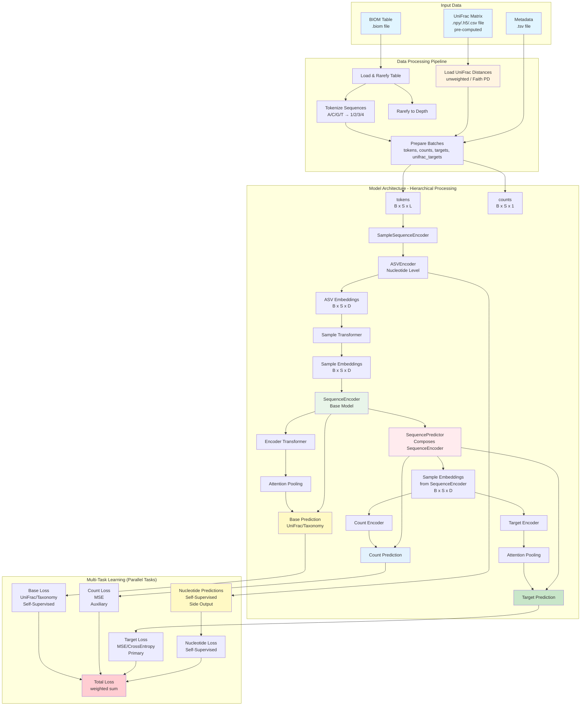

# AAM Architecture

Deep learning model for microbial sequencing data analysis using transformer-based attention mechanisms.

## Overview

AAM processes nucleotide sequences at multiple levels (nucleotide, ASV, sample) and uses phylogenetic information from reference trees for self-supervised learning.

## Architecture Diagram



---

## Design Decisions

### Why Composition Over Inheritance?

**Decision:** SequencePredictor *composes* SequenceEncoder rather than inheriting from it.

**Rationale:**
- **Checkpoint loading**: Can load pre-trained SequenceEncoder directly into `self.base_model`
- **Freeze control**: Easy to freeze base model with `requires_grad_(False)` on a single attribute
- **Flexibility**: Can swap different base models without changing SequencePredictor
- **Clarity**: Clear boundary between "what was pre-trained" and "what is new"

```python
# SequencePredictor composes SequenceEncoder
class SequencePredictor(nn.Module):
    def __init__(self, ...):
        self.base_model = SequenceEncoder(...)  # Composition
        self.target_head = ...  # New head
```

### Why Hierarchical Processing?

**Decision:** Process at three levels: nucleotide → ASV → sample.

**Rationale:**
- **Nucleotide level**: Captures sequence motifs, taxonomic signatures (150bp resolution)
- **ASV level**: Captures community composition, co-occurrence patterns (1000s of sequences)
- **Sample level**: Aggregates to sample predictions

**Analogy:** Like NLP processing characters → words → documents, each level captures different patterns.

**Trade-off:** More computation, but biologically meaningful representations at each level.

### Why Pre-computed UniFrac?

**Decision:** UniFrac matrices must be pre-computed externally, not computed on-the-fly.

**Rationale:**
- **Computational cost**: UniFrac requires phylogenetic tree traversal - O(N²) for N samples
- **External dependency**: Requires phylogenetic tree that may not be available at inference
- **Memory**: Full UniFrac matrix for large datasets doesn't fit in GPU memory
- **Reproducibility**: Pre-computed ensures consistent distances across runs

**Implementation:** Use `ssu` from unifrac-binaries, store as `.npy`, `.h5`, or `.csv`.

### Why Self-Supervised Pre-training?

**Decision:** Pre-train on UniFrac + nucleotide prediction before supervised fine-tuning.

**Rationale:**
- **Label scarcity**: Microbiome datasets often have few labeled samples
- **Transfer learning**: Phylogenetic patterns transfer across datasets
- **Regularization**: Self-supervised objectives prevent overfitting to small labeled sets
- **Biological prior**: UniFrac encodes evolutionary relationships

**Evidence:** Pre-training improves downstream performance, especially with limited labels.

### Why Even Batch Sizes?

**Decision:** Batch size must be even for training.

**Rationale:** UniFrac loss computes pairwise distances within a batch. With B samples:
- Need B/2 pairs for loss computation
- Odd batch would leave one sample unpaired
- Implementation pairs samples (0,1), (2,3), ..., (B-2, B-1)

**Constraint:** `--batch-size` must be even, enforced at CLI level.

### Why Attention Pooling Over Mean Pooling?

**Decision:** Use learned attention pooling instead of simple mean/max pooling.

**Rationale:**
- **Variable importance**: Not all ASVs contribute equally to prediction
- **Learned weighting**: Model learns which ASVs are informative
- **Interpretability**: Attention weights show which ASVs drive predictions

**Implementation:** `AttentionPooling` in `aam/models/attention_pooling.py:1`

---

## Trade-offs

### Memory vs. Accuracy: token_limit

| Setting | Memory | Accuracy | Use Case |
|---------|--------|----------|----------|
| `--token-limit 1024` | High | Best | Large GPU (48GB+) |
| `--token-limit 512` | Medium | Good | Standard GPU (24GB) |
| `--token-limit 256` | Low | Acceptable | Limited GPU or large batches |

**Guidance:** Start with 1024, reduce if OOM. Most discriminative information is in top-abundance ASVs.

### Freeze-base vs. Fine-tune Jointly

| Strategy | Training Time | Performance | Use Case |
|----------|---------------|-------------|----------|
| `--freeze-base` | Fast | Good | Limited data, quick experiments |
| Joint fine-tuning | Slow | Best | Sufficient data, final model |

**Guidance:** Use `--freeze-base` for iteration, remove for final training.

### Fusion Strategy Selection

| Strategy | Overhead | Use Case |
|----------|----------|----------|
| `concat` | Minimal | Default, simple conditioning |
| `add` | Minimal | Alternative to concat |
| `gmu` | Low | Adaptive weighting needed |
| `cross-attention` | High | Position-specific modulation |

**Guidance:** Start with `concat`, try `gmu` if performance plateaus, use `cross-attention` for complex relationships.

### Gradient Checkpointing

| Setting | Memory | Speed |
|---------|--------|-------|
| Enabled (default) | Lower | ~20% slower |
| Disabled | Higher | Faster |

**Guidance:** Keep enabled unless memory is not a concern.

---

## Model Components

### Data Pipeline

| Component | File | Input | Output |
|-----------|------|-------|--------|
| **BIOMLoader** | `aam/data/biom_loader.py:15` | `.biom` file | Rarefied table, sequences |
| **UniFracLoader** | `aam/data/unifrac_loader.py:12` | `.npy/.h5/.csv` | Distance matrix `[N, N]` |
| **SequenceTokenizer** | `aam/data/tokenizer.py:8` | Nucleotide strings | Token tensors `[S, L]` |
| **ASVDataset** | `aam/data/dataset.py:45` | Table + UniFrac + metadata | Batches for training |

### Model Architecture

| Component | File | Input Shape | Output Shape |
|-----------|------|-------------|--------------|
| **ASVEncoder** | `aam/models/asv_encoder.py:18` | `[B, S, L]` | `[B, S, D]` |
| **SampleSequenceEncoder** | `aam/models/sample_sequence_encoder.py:12` | `[B, S, L]` | `[B, S, D]` |
| **SequenceEncoder** | `aam/models/sequence_encoder.py:15` | `[B, S, L]` | `[B, D]` + UniFrac pred |
| **SequencePredictor** | `aam/models/sequence_predictor.py:20` | `[B, S, L]` | `[B, out_dim]` |

### Core Layers

| Component | File | Purpose |
|-----------|------|---------|
| **AttentionPooling** | `aam/models/attention_pooling.py:8` | Variable-length → fixed vector |
| **PositionEmbedding** | `aam/models/position_embedding.py:6` | Add positional information |
| **TransformerEncoder** | `aam/models/transformer.py:10` | Self-attention processing |

### Fusion Modules

| Component | File | Purpose |
|-----------|------|---------|
| **ConcatFusion** | `aam/models/fusion.py:25` | Concatenate + project |
| **GMUFusion** | `aam/models/fusion.py:58` | Gated multimodal unit |
| **CrossAttentionFusion** | `aam/models/fusion.py:95` | Position-specific attention |

### Training

| Component | File | Purpose |
|-----------|------|---------|
| **MultiTaskLoss** | `aam/training/losses.py:45` | Combine target/UniFrac/nuc/count losses |
| **Trainer** | `aam/training/trainer.py:30` | Training loop, checkpointing |
| **Metrics** | `aam/training/metrics.py:10` | R², MAE, accuracy, F1 |

---

## Extension Points

### Adding a New Fusion Strategy

1. **Create class** in `aam/models/fusion.py`:
```python
class MyFusion(nn.Module):
    def __init__(self, seq_dim: int, cat_dim: int, output_dim: int):
        ...

    def forward(self, seq_emb: Tensor, cat_emb: Tensor) -> Tensor:
        # seq_emb: [B, S, D] or [B, D]
        # cat_emb: [B, cat_dim]
        # return: [B, S, output_dim] or [B, output_dim]
        ...
```

2. **Register** in `CategoricalFusion.STRATEGIES`:
```python
STRATEGIES = {
    "concat": ConcatFusion,
    "gmu": GMUFusion,
    "my_fusion": MyFusion,  # Add here
}
```

3. **Add tests** in `tests/test_fusion.py`

4. **Document** in `docs/user-guide.md`

### Adding a New Loss Function

1. **Create function** in `aam/training/losses.py`:
```python
def my_loss(pred: Tensor, target: Tensor) -> Tensor:
    ...
```

2. **Register** in `MultiTaskLoss` or target loss selection

3. **Add CLI option** in `aam/cli/train.py`:
```python
@click.option("--loss-type", type=click.Choice([..., "my_loss"]))
```

4. **Add tests** in `tests/test_losses.py`

### Adding a New Prediction Head

1. **Create class** in `aam/models/` or extend `SequencePredictor`

2. **Follow pattern** of existing heads (count_encoder, target_encoder)

3. **Add to loss computation** in `MultiTaskLoss`

4. **Add CLI options** as needed

### Adding a New CLI Command

1. **Create file** `aam/cli/mycommand.py`:
```python
import click
from aam.cli import cli

@cli.command()
@click.option("--my-option", ...)
def mycommand(my_option):
    ...
```

2. **Import** in `aam/cli/__init__.py`

3. **Add tests** in `tests/test_cli.py` or dedicated file

---

## Dimension Reference

| Symbol | Meaning | Default | Controlled By |
|--------|---------|---------|---------------|
| **B** | Batch size | 8 | `--batch-size` |
| **S** | Max ASVs per sample | 1024 | `--token-limit` |
| **L** | Max base pairs per ASV | 150 | `--max-bp` |
| **D** | Embedding dimension | 128 | `--embedding-dim` |
| **H** | Attention heads | 4 | `--attention-heads` |
| **N** | Number of transformer layers | 4 | `--attention-layers` |

---

## File Structure

```
aam/
├── data/
│   ├── __init__.py
│   ├── biom_loader.py        # BIOM table loading and rarefaction
│   ├── unifrac_loader.py     # Pre-computed UniFrac matrix loading
│   ├── tokenizer.py          # Sequence tokenization
│   ├── dataset.py            # PyTorch Dataset and collate function
│   ├── categorical.py        # Categorical metadata encoding
│   └── normalization.py      # Target normalization strategies
├── models/
│   ├── __init__.py
│   ├── attention_pooling.py  # Attention pooling layer
│   ├── position_embedding.py # Position embedding layer
│   ├── transformer.py        # Transformer encoder
│   ├── asv_encoder.py        # ASV-level sequence encoder
│   ├── sample_sequence_encoder.py  # Sample-level encoder
│   ├── sequence_encoder.py   # Base model with UniFrac prediction
│   ├── sequence_predictor.py # Main prediction model
│   ├── categorical_embedder.py # Categorical embedding
│   ├── fusion.py             # Fusion strategies (concat, GMU, cross-attn)
│   └── model_summary.py      # Model parameter counting
├── training/
│   ├── __init__.py
│   ├── losses.py             # Multi-task loss functions
│   ├── metrics.py            # Evaluation metrics
│   ├── trainer.py            # Training and validation loops
│   ├── evaluation.py         # Validation evaluation
│   ├── distributed.py        # DDP/FSDP support
│   ├── lr_finder.py          # Learning rate finder
│   └── batch_size_finder.py  # Auto batch size optimization
└── cli/
    ├── __init__.py           # Main CLI group
    ├── __main__.py           # Entry point
    ├── utils.py              # Shared utilities
    ├── training_utils.py     # Training setup utilities
    ├── train.py              # Train command
    ├── pretrain.py           # Pretrain command
    ├── predict.py            # Predict command
    └── rf_baseline.py        # Random Forest baseline
```

---

## Further Reading

- [How It Works](docs/how-it-works.md) - Concepts and implementation walkthrough
- [User Guide](docs/user-guide.md) - CLI reference
- [Design Plans](_design_plan/INDEX.md) - Detailed implementation documents
