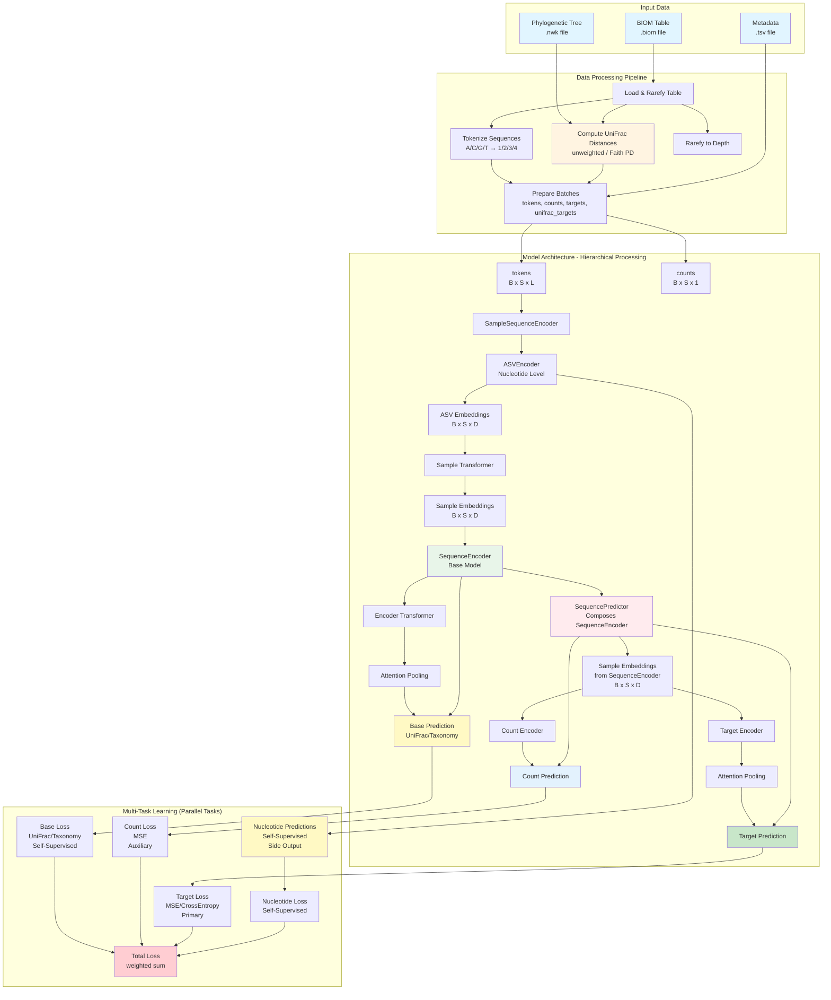

# AAM Architecture

Deep learning model for microbial sequencing data analysis using transformer-based attention mechanisms.

## Overview

AAM processes nucleotide sequences at multiple levels (nucleotide, ASV, sample) and uses phylogenetic information from reference trees for self-supervised learning.

## Architecture

**Key Design Points:**
- **SequencePredictor composes SequenceEncoder**: Composition pattern enables flexible base model swapping
- **Hierarchical processing**: Nucleotide → ASV → Sample level embeddings
- **Parallel multi-task learning**: All tasks share base embeddings but compute predictions in parallel
- **Self-supervised learning**: UniFrac and nucleotide predictions used for loss only, not as input

### Architecture Flow Diagram



## Model Components

### Data Pipeline
- **BIOMLoader**: Loads and rarefies BIOM tables
- **UniFracComputer**: Computes phylogenetic distances (unweighted UniFrac, Faith PD)
- **SequenceTokenizer**: Converts nucleotide sequences (A/C/G/T) to tokens (1/2/3/4)
- **ASVDataset**: PyTorch Dataset with custom collate function for variable ASV counts

### Model Architecture

**ASVEncoder**: Processes nucleotide sequences → ASV embeddings `[B, S, D]`
- Token embeddings + Position embeddings
- Transformer encoder
- Attention pooling
- Optional nucleotide prediction head

**SampleSequenceEncoder**: Processes ASV embeddings at sample level
- Composes ASVEncoder
- Sample-level position embeddings
- Sample-level transformer
- Output: Sample embeddings `[B, S, D]`

**SequenceEncoder**: Base model with UniFrac prediction head
- Composes SampleSequenceEncoder
- Encoder transformer + Attention pooling
- Output: Base predictions (UniFrac/Taxonomy) + Sample embeddings
- Types: `unifrac`, `taxonomy`, `faith_pd`, `combined`

**SequencePredictor**: Main prediction model
- Composes SequenceEncoder as `base_model`
- Count encoder: Predicts ASV counts `[B, S, 1]`
- Target encoder: Predicts sample targets `[B, out_dim]`
- Supports `freeze_base` for transfer learning

## Multi-Task Learning

**Primary Task**: Target prediction (regression/classification)

**Auxiliary Tasks** (parallel, share base embeddings):
- **Count prediction**: Predicts ASV abundances
- **UniFrac prediction**: Self-supervised, phylogenetic signal (loss only)
- **Nucleotide prediction**: Self-supervised, sequence patterns (loss only)

**Important**: Base predictions and nucleotide predictions are side outputs used for loss computation only. They do NOT feed into target prediction.

## Training Strategy

### Staged Training (Recommended)

**Stage 1: Pre-train SequenceEncoder**
- Self-supervised: UniFrac + nucleotide prediction
- No target labels required
- Saves checkpoint for Stage 2

**Stage 2: Train SequencePredictor**
- Option A: Freeze base (`--freeze-base`) - faster
- Option B: Fine-tune jointly - better performance

### Training Configuration

- **Optimizer**: AdamW (weight decay: 0.01)
- **Learning Rate**: 1e-4 with warmup (10k steps) + cosine decay
- **Early Stopping**: Patience 50 epochs
- **Batch Size**: Must be even for UniFrac pairwise distances

## Dimension Reference

- **B**: Batch size (must be even)
- **S**: Maximum ASVs per sample (token_limit, default: 1024)
- **L**: Maximum base pairs per sequence (max_bp, default: 150)
- **D**: Embedding dimension (default: 128)
- **H**: Number of attention heads (default: 4)

## File Structure

```
aam/
├── data/
│   ├── __init__.py
│   ├── biom_loader.py        # BIOM table loading and rarefaction
│   ├── unifrac.py            # UniFrac distance computation
│   ├── tokenizer.py          # Sequence tokenization
│   └── dataset.py            # PyTorch Dataset and collate function
├── models/
│   ├── __init__.py
│   ├── attention_pooling.py  # Attention pooling layer
│   ├── position_embedding.py # Position embedding layer
│   ├── transformer.py        # Transformer encoder
│   ├── asv_encoder.py        # ASV-level sequence encoder
│   ├── sample_sequence_encoder.py  # Sample-level encoder
│   ├── sequence_encoder.py   # Base model with UniFrac prediction
│   └── sequence_predictor.py # Main prediction model
├── training/
│   ├── __init__.py
│   ├── losses.py             # Multi-task loss functions
│   ├── metrics.py            # Evaluation metrics
│   └── trainer.py            # Training and validation loops
└── cli.py                    # Command-line interface
```

See `_design_plan/` for detailed implementation documentation.
