# AAM Model Architecture Diagram

This document provides visual representations of the AAM (Attention All Microbes) model architecture.

## High-Level Architecture Overview


## SequenceRegressor Detailed Architecture


## BaseSequenceEncoder Architecture


## Data Flow Through Generators

```mermaid
sequenceDiagram
    participant CLI as CLI Command
    participant GEN as GeneratorDataset
    participant TABLE as BIOM Table
    participant META as Metadata
    participant DS as TensorFlow Dataset
    
    CLI->>GEN: Initialize with table, metadata
    GEN->>TABLE: Load BIOM table
    GEN->>META: Load and normalize metadata
    GEN->>TABLE: Rarefy to depth
    GEN->>GEN: Tokenize sequences (A/C/G/T ? 1/2/3/4)
    GEN->>GEN: Create encoder targets
    
    CLI->>GEN: get_data()
    GEN->>GEN: _create_epoch_generator()
    loop Each Epoch
        GEN->>TABLE: New rarefied table
        loop Each Batch
            GEN->>GEN: Sample batch indices
            GEN->>GEN: Extract batch data
            GEN->>GEN: Sort ASVs by count
            GEN->>GEN: Limit to max_token_per_sample
            GEN->>GEN: Pad sequences
            GEN->>DS: Yield (tokens, counts, y_target, encoder_target)
        end
    end
    GEN->>CLI: Return dataset dict
```



## Training Pipeline Architecture


## Encoder Types Architecture


## Loss Computation Flow


## Attention Mechanism Details


## Model Component Hierarchy


## Dimension Flow

```mermaid
graph LR
    subgraph "Input Dimensions"
        I1[nuc_tokens:<br/>B x S x L]
        I2[counts:<br/>B x S x 1]
    end
    
    subgraph "ASVEncoder"
        I1 --> E1[Embedding:<br/>B x S x L x D]
        E1 --> P1[+ Position:<br/>B x S x L x D]
        P1 --> T1[Transformer:<br/>B x S x L x D]
        T1 --> A1[Pooling:<br/>B x S x D]
    end
    
    subgraph "Sample-Level"
        A1 --> P2[+ Position:<br/>B x S x D]
        P2 --> T2[Transformer:<br/>B x S x D]
    end
    
    subgraph "SequenceEncoder"
        T2 --> T3[Transformer:<br/>B x S x D]
        T3 --> A2[Pooling:<br/>B x D]
        A2 --> D1[Dense:<br/>B x base_dim]
    end
    
    subgraph "SequenceRegressor"
        T2 --> T4[Count Encoder:<br/>B x S x D]
        T2 --> T5[Target Encoder:<br/>B x S x D]
        T4 --> D2[Dense 1:<br/>B x S x 1]
        T5 --> A3[Pooling:<br/>B x D]
        A3 --> D3[Dense:<br/>B x out_dim]
    end
    
    Legend:
    B = Batch size
    S = Sequence length (max ASVs per sample)
    L = Sequence length (max base pairs)
    D = Embedding dimension
```

## Notes

- **B**: Batch size
- **S**: Maximum number of ASVs per sample (token_limit)
- **L**: Maximum number of base pairs per sequence (max_bp)
- **D**: Embedding dimension (typically 128)
- **base_dim**: Base encoder output dimension
- **out_dim**: Final output dimension (1 for regression, num_classes for classification)

## Key Components

1. **ASVEncoder**: Processes individual sequences at nucleotide level
2. **BaseSequenceEncoder**: Combines ASV embeddings with sample-level processing
3. **SequenceEncoder**: Adds encoder-specific prediction head
4. **SequenceRegressor**: Adds count and target prediction heads
5. **AttentionPooling**: Pools sequence-level embeddings to sample-level
6. **TransformerEncoder**: Standard transformer encoder blocks

## Data Flow Summary

1. **Input**: Tokenized sequences (A/C/G/T ? 1/2/3/4) and counts
2. **Nucleotide-level**: ASVEncoder processes each sequence
3. **Sample-level**: Transformer processes ASV embeddings
4. **Encoder**: Predicts encoder-specific targets (taxonomy, UniFrac, etc.)
5. **Regressor**: Predicts final targets (sample metadata) and counts
6. **Output**: Predictions at multiple levels (nucleotide, ASV, sample)
