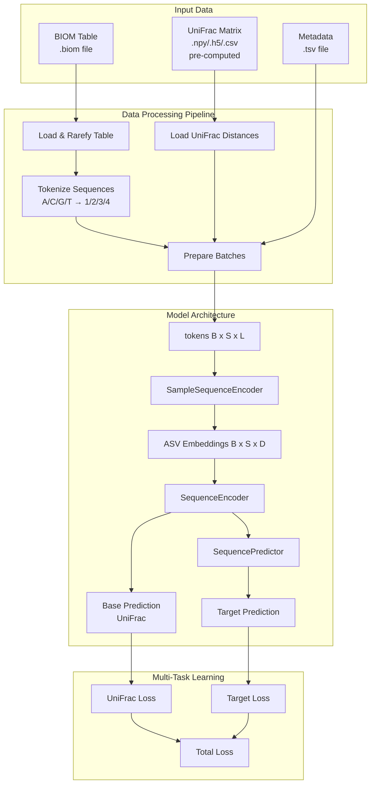

# PyTorch Implementation Plan - Overview

## Project Summary
AAM (Attention All Microbes) - a deep learning model for microbial sequencing data analysis using transformer-based attention mechanisms. Processes nucleotide sequences at multiple levels (nucleotide, ASV, sample) with self-supervised learning from phylogenetic information.

## Architecture Overview

**Key Architecture Points**:
- **SequencePredictor composes SequenceEncoder**: Composition pattern (not inheritance)
- **Sample embeddings flow**: SampleSequenceEncoder → SequenceEncoder → SequencePredictor
- **Parallel tasks**: All prediction tasks share base embeddings, computed in parallel
- **Side outputs**: Base predictions (UniFrac) and nucleotide predictions used only for loss, NOT as input



## Core Design Principles

### 1. Hierarchical Multi-Level Attention
- **Nucleotide level**: Process individual sequences (ASVEncoder)
- **ASV level**: Process multiple sequences per sample (SampleSequenceEncoder)
- **Sample level**: Aggregate to sample-level predictions (SequenceEncoder/SequencePredictor)

### 2. Compositional Model Architecture
- **SampleSequenceEncoder**: Core processing (nucleotide + sample level)
- **SequenceEncoder**: Adds UniFrac prediction head, returns sample embeddings
- **SequencePredictor**: Composes SequenceEncoder, adds target/count prediction

### 3. Self-Supervised Learning
- **Nucleotide prediction**: Learn sequence patterns (masked autoencoder)
- **UniFrac prediction**: Learn phylogenetic relationships from pre-computed distances
- **Key**: These are side outputs for loss only, NOT used as input to other heads

### 4. Transfer Learning Support
- **Freeze base model**: Can freeze SequenceEncoder in SequencePredictor
- **Pre-training**: Train SequenceEncoder, then fine-tune SequencePredictor

## Training Strategy

### Staged Training (Recommended)

**Stage 1: Pre-train SequenceEncoder (Self-Supervised)**
- Objective: Learn representations from UniFrac and nucleotide prediction
- Data: BIOM table + pre-computed UniFrac matrix (no labels required)
- Output: Trained SequenceEncoder checkpoint

**Stage 2: Train SequencePredictor**
- Option A: Freeze Base (`--freeze-base`) - faster training
- Option B: Fine-tune Jointly - better performance

### Training Configuration
- **Optimizer**: AdamW with weight decay (0.01)
- **Learning Rate**: 1e-4 with warmup + cosine decay
- **Batch Size**: Must be even for UniFrac (pairwise distances)

## Data Pipeline

### Input Requirements
1. **BIOM Table** (`.biom`): Microbial abundance data
2. **UniFrac Matrix** (`.npy`, `.h5`, `.csv`): Pre-computed phylogenetic distances
3. **Metadata** (`.tsv`): Sample metadata with target column (for Stage 2)

**Note:** UniFrac matrices must be generated externally using `ssu` from unifrac-binaries.

## File Structure

```
aam/
├── data/
│   ├── biom_loader.py        # BIOM table loading
│   ├── unifrac_loader.py     # Pre-computed UniFrac loading
│   ├── tokenizer.py          # Sequence tokenization
│   └── dataset.py            # PyTorch Dataset
├── models/
│   ├── attention_pooling.py
│   ├── position_embedding.py
│   ├── transformer.py
│   ├── asv_encoder.py
│   ├── sample_sequence_encoder.py
│   ├── sequence_encoder.py   # Base model
│   └── sequence_predictor.py # Main model (composes encoder)
├── training/
│   ├── losses.py
│   ├── metrics.py
│   └── trainer.py
└── cli/
    ├── __init__.py           # Main CLI group
    ├── utils.py              # Shared utilities
    ├── train.py              # Train command
    ├── pretrain.py           # Pretrain command
    └── predict.py            # Predict command
```

## Dimension Reference

- **B**: Batch size (must be even)
- **S**: Maximum ASVs per sample (token_limit, default: 1024)
- **L**: Maximum base pairs per sequence (max_bp, default: 150)
- **D**: Embedding dimension (default: 128)

## Implementation Status

All core components implemented and tested (635 tests, ~94% coverage).

See **[FUTURE_WORK.md](FUTURE_WORK.md)** for potential enhancements.
