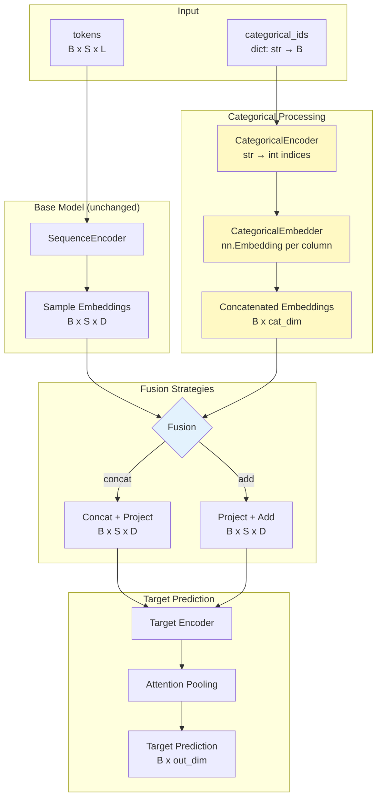

# Categorical Feature Integration

**Status:** In Progress (CAT-1 complete, CAT-2 through CAT-7 planned)

## Overview

Add support for categorical metadata features (e.g., location, season, site type) that condition target predictions. Categorical embeddings are injected into the target prediction pathway, allowing the model to learn location-specific or season-specific patterns.

## Architecture

### Data Flow



### Key Design Points

1. **Categorical embeddings condition target predictions only**
   - Base model (SequenceEncoder) unchanged
   - Count encoder unchanged
   - Only target encoder pathway receives categorical information

2. **Flexible schema**
   - Support arbitrary categorical columns without hardcoding
   - Per-column embedding dimensions or shared dimension
   - Handle missing values with reserved index 0

3. **Two fusion strategies**
   - **Concatenate + project**: `[B, S, D + cat_dim]` → Linear → `[B, S, D]`
   - **Additive conditioning**: Project cat embeddings to D, broadcast, add

4. **Backward compatible**
   - Models without categoricals work identically
   - Existing checkpoints load without error

## Components

### CategoricalEncoder (`aam/data/categorical.py`)

Encodes string categories to integer indices for embedding lookup.

```python
class CategoricalEncoder:
    """Encodes categorical metadata columns to integer indices.

    Index 0 reserved for unknown/missing values.
    Indices 1-N for known categories (fit from training data).
    """

    def fit(self, metadata: pd.DataFrame, columns: list[str]) -> "CategoricalEncoder":
        """Learn category mappings from training data."""

    def transform(self, metadata: pd.DataFrame) -> dict[str, np.ndarray]:
        """Transform categories to indices. Unknown → 0."""

    def save(self, path: Path) -> None:
        """Serialize encoder state."""

    @classmethod
    def load(cls, path: Path) -> "CategoricalEncoder":
        """Load encoder from file."""
```

### CategoricalEmbedder (`aam/models/categorical_embedder.py`)

Embeds categorical indices and produces conditioning vectors.

```python
class CategoricalEmbedder(nn.Module):
    """Embeds categorical features for conditioning.

    Args:
        column_cardinalities: dict mapping column name to number of categories
        embed_dim: embedding dimension per column (or dict for per-column dims)
        dropout: dropout on embeddings
    """

    def __init__(
        self,
        column_cardinalities: dict[str, int],
        embed_dim: int = 16,
        dropout: float = 0.1,
    ):
        # Create nn.Embedding for each column
        # Index 0 = padding (unknown/missing)

    def forward(
        self,
        categorical_ids: dict[str, torch.Tensor],
    ) -> torch.Tensor:
        """
        Args:
            categorical_ids: dict mapping column name to indices [B]

        Returns:
            Concatenated embeddings [B, total_embed_dim]
        """

    def broadcast_to_sequence(
        self,
        embeddings: torch.Tensor,
        seq_len: int,
    ) -> torch.Tensor:
        """Broadcast [B, cat_dim] to [B, S, cat_dim]."""
```

### SequencePredictor Updates (`aam/models/sequence_predictor.py`)

```python
class SequencePredictor(nn.Module):
    def __init__(
        self,
        # ... existing args ...
        categorical_cardinalities: dict[str, int] | None = None,
        categorical_embed_dim: int = 16,
        categorical_fusion: str = "concat",  # "concat" or "add"
    ):
        if categorical_cardinalities:
            self.categorical_embedder = CategoricalEmbedder(
                categorical_cardinalities,
                categorical_embed_dim,
            )
            if categorical_fusion == "concat":
                total_cat_dim = len(categorical_cardinalities) * categorical_embed_dim
                self.categorical_projection = nn.Linear(
                    self.embedding_dim + total_cat_dim,
                    self.embedding_dim,
                )
            else:  # add
                self.categorical_projection = nn.Linear(
                    len(categorical_cardinalities) * categorical_embed_dim,
                    self.embedding_dim,
                )
        else:
            self.categorical_embedder = None

    def forward(
        self,
        tokens: torch.Tensor,
        categorical_ids: dict[str, torch.Tensor] | None = None,
        return_nucleotides: bool = False,
    ) -> dict[str, torch.Tensor]:
        # ... base model forward ...

        if self.categorical_embedder is not None and categorical_ids is not None:
            cat_emb = self.categorical_embedder(categorical_ids)  # [B, cat_dim]
            cat_emb_seq = cat_emb.unsqueeze(1).expand(-1, base_embeddings.size(1), -1)

            if self.categorical_fusion == "concat":
                fused = torch.cat([base_embeddings, cat_emb_seq], dim=-1)
                target_input = self.categorical_projection(fused)
            else:  # add
                cat_proj = self.categorical_projection(cat_emb_seq)
                target_input = base_embeddings + cat_proj
        else:
            target_input = base_embeddings

        # ... target encoder forward with target_input ...
```

## CLI Interface

```bash
# Train with categorical features
aam train \
    --table data.biom \
    --unifrac-matrix unifrac.npy \
    --metadata meta.tsv \
    --metadata-column target_col \
    --categorical-columns location,season \
    --categorical-embed-dim 16 \
    --categorical-fusion concat \
    --output-dir output/

# Predict (auto-loads encoder from checkpoint)
aam predict \
    --model output/best_model.pt \
    --table new_data.biom \
    --metadata new_meta.tsv \
    --output predictions.tsv
```

## Checkpoint Format

```python
checkpoint = {
    "model_state_dict": model.state_dict(),
    "config": {
        # ... existing config ...
        "categorical_columns": ["location", "season"],
        "categorical_embed_dim": 16,
        "categorical_fusion": "concat",
    },
    "categorical_encoder": {
        "location": {"outdoor": 1, "indoor": 2, "mixed": 3},
        "season": {"spring": 1, "summer": 2, "fall": 3, "winter": 4},
    },
}
```

## Transfer Learning

### Stage 1 → Stage 2 with Categoricals

```bash
# Stage 1: Pretrain (no categoricals)
aam pretrain --table data.biom --unifrac-matrix unifrac.npy --output-dir pretrain/

# Stage 2: Fine-tune with categoricals
aam train \
    --checkpoint pretrain/best_model.pt \
    --categorical-columns location,season \
    --freeze-base \
    --output-dir finetune/
```

When loading a pretrained checkpoint without categoricals:
- Base model weights loaded normally
- Categorical embedder initialized fresh (Xavier init)
- `--freeze-base` freezes base but trains categorical embedder + target encoder

## Testing Strategy

### Unit Tests

- `CategoricalEncoder`: fit, transform, unknown handling, serialization
- `CategoricalEmbedder`: forward, broadcast, padding index behavior
- `SequencePredictor`: with/without categoricals, fusion strategies

### Integration Tests

- Full training loop with synthetic categorical data
- Checkpoint save/load with categorical encoder
- Pretrain → fine-tune with categoricals workflow

## Implementation Order

1. **CAT-1**: Schema definition (`aam/data/categorical.py` - dataclasses)
2. **CAT-2**: CategoricalEncoder + dataset integration
3. **CAT-3**: CategoricalEmbedder module
4. **CAT-4**: SequencePredictor integration
5. **CAT-5**: CLI updates
6. **CAT-6**: Checkpoint/transfer learning
7. **CAT-7**: Documentation and tests

## Future Extensions (Out of Scope)

- **Hierarchical embeddings**: Nested categories (region → site → plot)
- **Cross-dataset transfer**: Map categories between related datasets
- **Category interactions**: Attention between categorical embeddings before fusion
