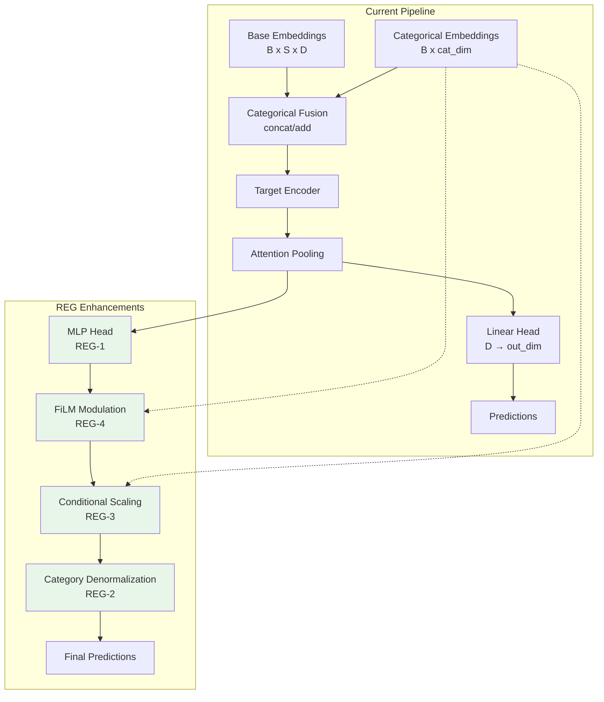

# Regressor Optimization

**Status:** Planned (REG-1 through REG-9)

## Motivation

### The Problem: Multi-Environment Distributional Shift

When training on data from multiple environments (locations) and seasons, the target variable exhibits systematic differences:

```
Location A (urban, summer):    mean=0.32, std=0.08
Location A (urban, winter):    mean=0.41, std=0.12
Location B (coastal, summer):  mean=0.68, std=0.15
Location B (coastal, winter):  mean=0.55, std=0.11
```

These differences arise from:
1. **Baseline shifts**: Different environments have fundamentally different target distributions
2. **Scale differences**: Variance differs across conditions
3. **Feature-target relationships**: The same microbial pattern may predict different outcomes depending on context

### Current Architecture Limitations

The existing categorical feature integration (CAT-1 through CAT-7) uses simple fusion strategies:

```python
# Concat fusion: categorical embeddings concatenated to sequence embeddings
fused = torch.cat([base_embeddings, cat_emb_seq], dim=-1)
target_input = self.categorical_projection(fused)

# Add fusion: categorical embeddings added to sequence embeddings
cat_proj = self.categorical_projection(cat_emb_seq)
target_input = base_embeddings + cat_proj
```

**Limitation**: These approaches treat categorical context as additional features but don't explicitly model how categories should *transform* the prediction. The model must learn implicit compensation, which is difficult when:
- Category-specific effects are multiplicative (scaling) rather than additive
- Different categories require different feature weighting
- Some location-season combinations are missing (incomplete factorial design)

### Design Goals

1. **Explicit categorical compensation**: Directly model how categories shift and scale predictions
2. **Interpretable adjustments**: Learned scale/bias per category that can be inspected
3. **Expressive modulation**: Allow categories to selectively amplify/suppress features (FiLM)
4. **Uncertainty quantification**: Know when predictions are reliable vs. uncertain
5. **Backward compatibility**: All features optional; default behavior unchanged

---

## Architecture Overview



---

## Tier 1: Categorical Compensation

### REG-1: MLP Regression Head

**Reasoning**: A single linear layer `[D → out_dim]` limits the model's ability to learn non-linear feature combinations before prediction. Adding hidden layers enables:

1. **Non-linear feature mapping**: ReLU activations allow learning of threshold effects and interactions
2. **Dimensionality reduction**: Gradual compression (e.g., 128→64→32→1) creates information bottleneck that encourages learning robust features
3. **Foundation for FiLM**: FiLM layers (REG-4) modulate hidden activations—without hidden layers, there's nothing to modulate

**Architecture**:
```
pooled_embedding [B, D]
    → Linear(D, 64) → ReLU → Dropout
    → Linear(64, 32) → ReLU → Dropout
    → Linear(32, out_dim)
    → prediction [B, out_dim]
```

**Why not deeper?** The target encoder (TransformerEncoder) already provides substantial non-linear processing. The MLP head handles the final feature-to-prediction mapping—2-3 layers suffice.

---

### REG-2: Per-Category Target Normalization

**Reasoning**: If location A has mean=0.3 and location B has mean=0.7, the model wastes capacity learning to shift predictions based on location rather than learning the underlying biological signal.

**Solution**: Normalize targets within each category during training, denormalize at inference:

```python
# Training
target_normalized = (target - mean[location]) / std[location]
loss = mse(prediction, target_normalized)

# Inference
prediction_final = prediction * std[location] + mean[location]
```

**Benefits**:
1. **Removes distributional shift**: Model learns residuals from category-specific baselines
2. **Faster convergence**: All categories contribute equally to learning signal
3. **Interpretable**: Stored statistics reveal category-specific baselines
4. **Handles missing combinations**: Uses hierarchical fallback (location-season → location → global)

**Handling incomplete factorial designs**:
```python
# If location="coastal" + season="winter" has no training data:
# 1. Try location-season combination stats
# 2. Fall back to location-only stats
# 3. Fall back to global stats
```

---

### REG-3: Conditional Output Scaling

**Reasoning**: Even after normalization, categories may have residual effects that are multiplicative. For example, coastal locations might have 1.2x the variance of inland locations for the same microbiome patterns.

**Solution**: Learn per-category scale and bias parameters:

```python
# After base prediction
prediction = prediction * scale[location, season] + bias[location, season]
```

**Why separate from normalization (REG-2)?**
- REG-2: Fixed statistics computed from data (mean/std)
- REG-3: Learned parameters optimized end-to-end

The model can discover subtle adjustments that aren't captured by simple statistics.

**Initialization**: scale=1.0, bias=0.0 (identity transform) ensures stable training start.

---

### REG-4: FiLM Layers (Feature-wise Linear Modulation)

**Reasoning**: Concat/add fusion applies categorical information uniformly to all features. But categories likely affect features *selectively*:
- Season might modulate temperature-sensitive microbial signatures
- Location might modulate soil-type-associated features
- Some features might be category-invariant

**Solution**: FiLM allows categorical embeddings to generate per-feature scale (γ) and shift (β):

```python
# Standard MLP layer
h = ReLU(Linear(x))

# FiLM-modulated layer
h = Linear(x)
γ, β = FiLMGenerator(categorical_embedding)
h = γ * h + β  # Per-feature modulation
h = ReLU(h)
```

**Visual intuition**:
```
Feature dimension:     [0]   [1]   [2]   [3]   ...
                        ↓     ↓     ↓     ↓
γ (scale) for summer: [1.2] [0.8] [1.0] [1.5]  → amplify/suppress
β (shift) for summer: [0.1] [0.0] [-0.1][0.2]  → shift baseline
```

**Why FiLM over attention?**
- FiLM is computationally cheap (two linear projections)
- FiLM is interpretable (γ/β can be inspected)
- FiLM works well when conditioning is low-dimensional (categorical embeddings)
- Cross-attention (PYT-19.2) is better when both streams are high-dimensional sequences

**Paper reference**: Perez et al., "FiLM: Visual Reasoning with a General Conditioning Layer" (2018)

---

## Tier 2: Loss Functions

### REG-5: Quantile Regression

**Reasoning**: Point predictions don't capture uncertainty. When category effects vary, some predictions are inherently more uncertain than others.

**Solution**: Predict multiple quantiles (e.g., 10th, 50th, 90th percentiles):

```python
# Output: [B, 3] for quantiles [0.1, 0.5, 0.9]
# Provides prediction interval: [q_0.1, q_0.9]
# Point estimate: q_0.5 (median)
```

**Benefits**:
1. **Calibrated uncertainty**: 80% of true values should fall within [q_0.1, q_0.9]
2. **Asymmetric intervals**: Can capture skewed uncertainty (e.g., more uncertain upward)
3. **Decision support**: Different actions for high-confidence vs. low-confidence predictions

**Pinball loss**:
```python
def pinball_loss(pred, target, quantile):
    error = target - pred
    return max(quantile * error, (quantile - 1) * error)
```

---

### REG-6: Asymmetric Loss

**Reasoning**: In some applications, over-prediction and under-prediction have different costs:
- Underestimating contamination: dangerous
- Overestimating contamination: wasteful but safe
- → Penalize under-prediction more heavily

**Solution**: Weighted loss based on error sign:

```python
error = pred - target
weight = over_penalty if error > 0 else under_penalty
loss = weight * error**2
```

**Use cases**:
- Safety-critical predictions: penalize dangerous direction
- Resource allocation: penalize costly direction
- Asymmetric business costs

---

## Tier 3: Architecture Variants

### REG-7: Residual Regression Head

**Reasoning**: Residual connections enable the model to learn both simple (linear) and complex (non-linear) relationships simultaneously:

```python
output = Linear(x) + MLP(x)
#        ↑           ↑
#     linear      non-linear
#     shortcut    processing
```

**Benefits**:
1. **Gradient flow**: Direct path for gradients during backprop
2. **Capacity control**: Model can "fall back" to linear if non-linear doesn't help
3. **Stable training**: Identity initialization means MLP starts as small perturbation

---

### REG-8: Per-Output Loss Configuration

**Reasoning**: For multi-output regression (predicting multiple targets), different targets may have different error characteristics:
- pH: Normally distributed errors → MSE
- Concentration: Heavy-tailed errors → Huber
- Binary-ish target: MAE more robust

**Solution**: Specify loss per target column:
```json
{"pH": "mse", "concentration": "huber", "presence": "mae"}
```

---

### REG-9: Mixture of Experts

**Reasoning**: The most expressive approach when categories represent fundamentally different domains. Each "expert" learns a complete input→output mapping for its domain.

```python
# 4 experts, each a full MLP
expert_outputs = [expert_i(x) for i in range(4)]

# Router determines expert weights from categorical embedding
weights = softmax(Router(categorical_emb))

# Weighted combination
output = sum(w_i * expert_i_output for i in range(4))
```

**When to use MoE**:
- Very different input-output relationships per category
- Sufficient data per category to train separate experts
- Simpler approaches (REG-2, REG-3, REG-4) insufficient

**Caution**: MoE can overfit if categories have limited data. Consider expert dropout or load balancing regularization.

---

## Implementation Strategy

### Composability

All REG features are designed to compose:

```
REG-2 (normalize) → REG-1 (MLP) → REG-4 (FiLM) → REG-3 (scale) → output
```

Each can be enabled independently:
```bash
# Just MLP head
--regressor-hidden-dims 64,32

# MLP + FiLM
--regressor-hidden-dims 64,32 --film-conditioning location,season

# Full stack
--normalize-targets-by location \
--regressor-hidden-dims 64,32 \
--film-conditioning location,season \
--conditional-output-scaling location,season
```

### Incremental Validation

Recommended experimental progression:

1. **Baseline**: Current architecture with concat fusion
2. **+REG-2**: Add per-category normalization → expect faster convergence
3. **+REG-1**: Add MLP head → expect slightly better final performance
4. **+REG-3**: Add conditional scaling → expect better per-category calibration
5. **+REG-4**: Add FiLM → expect best performance if categories strongly modulate features

Compare validation metrics at each stage to quantify contribution.

---

## Interaction with Existing Features

### Compatibility Matrix

| Feature | REG-1 | REG-2 | REG-3 | REG-4 | REG-5 | REG-6 |
|---------|-------|-------|-------|-------|-------|-------|
| `--output-activation` | ✓ | ✓ | ✓ | ✓ | ✓ | ✓ |
| `--bounded-targets` | ✓ | ✗* | ✓ | ✓ | ✗ | ✓ |
| `--learnable-output-scale` | ✓ | ✓ | ✗** | ✓ | ✓ | ✓ |
| `--categorical-fusion` | ✓ | ✓ | ✓ | ✓ | ✓ | ✓ |
| `--freeze-base` | ✓ | ✓ | ✓ | ✓ | ✓ | ✓ |

\* `--bounded-targets` implies [0,1] range; per-category normalization would denormalize outside this range
\** `--conditional-output-scaling` subsumes `--learnable-output-scale` with category-awareness

### Checkpoint Compatibility

REG features add new model parameters. Checkpoints without REG features load into REG-enabled models:
- MLP head: Xavier initialization for new layers
- Conditional scaling: scale=1.0, bias=0.0 (identity)
- FiLM generators: Zero initialization (no modulation initially)

---

## Testing Strategy

### Unit Tests

Each REG ticket includes tests for:
1. **Construction**: Model builds correctly with various flag combinations
2. **Forward pass**: Output shapes correct, no NaN/Inf
3. **Gradient flow**: All new parameters receive gradients
4. **Initialization**: Identity behavior at initialization (where applicable)

### Integration Tests

1. **Training loop**: Full epoch completes without error
2. **Checkpoint roundtrip**: Save/load preserves behavior
3. **Composition**: Multiple REG features enabled simultaneously
4. **Backward compatibility**: Models without REG features still work

### Validation Metrics

Track during experiments:
- **Per-category RMSE**: Does compensation reduce category-specific error?
- **Calibration**: Do quantile predictions have correct coverage?
- **Convergence speed**: Does normalization accelerate training?
- **Feature importance**: Which FiLM γ values are largest? (interpretability)

---

## Summary

| Ticket | Addresses | Key Mechanism |
|--------|-----------|---------------|
| REG-1 | Limited expressivity | Hidden layers before output |
| REG-2 | Baseline shift | Category-specific normalization |
| REG-3 | Scale differences | Learned per-category scale/bias |
| REG-4 | Feature-category interaction | FiLM modulation of hidden layers |
| REG-5 | Uncertainty | Quantile prediction |
| REG-6 | Asymmetric costs | Directional loss weighting |
| REG-7 | Gradient flow | Residual connection |
| REG-8 | Multi-output heterogeneity | Per-target loss functions |
| REG-9 | Domain separation | Expert specialization |

The core insight: **categorical features should not just be additional inputs, but should actively transform how the model processes and outputs predictions**.
