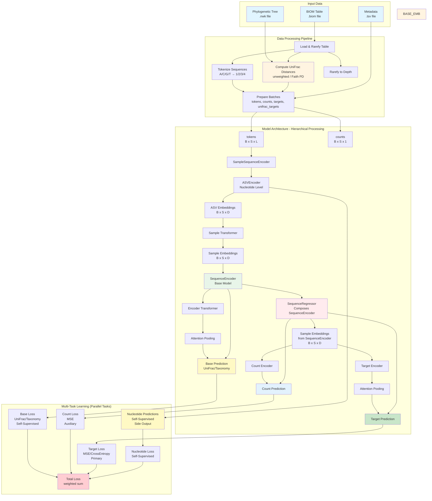

# PyTorch Implementation Plan - Overview

## Project Summary
Build AAM (Attention All Microbes) - a deep learning model for microbial sequencing data analysis using transformer-based attention mechanisms. The model processes nucleotide sequences at multiple levels (nucleotide, ASV, sample) and uses phylogenetic information from reference trees for self-supervised learning.

## Architecture Overview

**Key Architecture Points**:
- **SequenceRegressor composes SequenceEncoder**: SequenceRegressor contains SequenceEncoder as `base_model` (not SampleSequenceEncoder)
- **Sample embeddings flow**: SampleSequenceEncoder → SequenceEncoder → SequenceRegressor (via base_model output)
- **Parallel tasks**: All prediction tasks (nucleotide, UniFrac, count, target) share base embeddings but are computed in parallel
- **Side outputs**: Base predictions (UniFrac) and nucleotide predictions are used only for loss computation, NOT as input to other heads



## Core Design Principles

### 1. Hierarchical Multi-Level Attention
- **Nucleotide level**: Process individual sequences (ASVEncoder)
- **ASV level**: Process multiple sequences per sample (SampleSequenceEncoder)
- **Sample level**: Aggregate to sample-level predictions (SequenceEncoder/SequenceRegressor)

### 2. Compositional Model Architecture
- **SampleSequenceEncoder**: Core processing (nucleotide + sample level)
- **SequenceEncoder**: Adds encoder-specific prediction head (UniFrac, Taxonomy, etc.)
  - Uses SampleSequenceEncoder internally
  - Produces sample embeddings `[B, S, D]` for downstream use
  - Produces base predictions (UniFrac/Taxonomy) for loss computation
- **SequenceRegressor**: Composes SequenceEncoder as `base_model` (composition, not inheritance)
  - Uses SequenceEncoder's sample embeddings (not base predictions) for count/target encoders
  - Base predictions from SequenceEncoder are used only for loss computation (self-supervised)
  - Can freeze SequenceEncoder for transfer learning

### 3. Self-Supervised Learning (Parallel Tasks)
- **Nucleotide prediction**: Learn sequence patterns (side output from ASVEncoder, loss only)
- **UniFrac prediction**: Learn phylogenetic relationships from tree (side output from SequenceEncoder, loss only)
- **Key**: These predictions are NOT used as input to target prediction or count prediction
- **Shared embeddings**: All tasks share base embeddings from SequenceEncoder, improving representations
- **Auxiliary tasks**: Improve main task (target prediction) through multi-task learning
- **Architecture**: Parallel tasks with shared representations, not sequential prediction

### 4. Multi-Task Learning (Parallel Architecture)
- **Primary task**: Predict sample metadata (regression/classification)
- **Auxiliary tasks** (all share base embeddings, NOT sequential):
  - Predict ASV counts (helps learn abundance patterns)
  - Predict UniFrac distances (self-supervised, phylogenetic signal, loss only)
  - Predict nucleotides (self-supervised, sequence patterns, loss only)
- **Important**: Base predictions (UniFrac) and nucleotide predictions are side outputs used for loss computation only. They do NOT feed into target prediction. All tasks share the same base embeddings.

### 5. Transfer Learning Support
- **Freeze base model**: Can freeze SequenceEncoder when used in SequenceRegressor
- **Shared embeddings**: Base embeddings shared between encoder and regressor heads
- **Pre-training**: Can pre-train SequenceEncoder, then fine-tune SequenceRegressor

## Training Strategy

### Recommended: Staged Training

**Stage 1: Pre-train SequenceEncoder (Self-Supervised)**
- **Objective**: Learn good base representations from UniFrac and nucleotide prediction
- **Data**: Only needs BIOM table + phylogenetic tree (no target labels required)
- **Losses**: Encoder loss (UniFrac) + Nucleotide loss
- **Output**: Trained SequenceEncoder checkpoint
- **Benefits**: 
  - Can use larger/unlabeled datasets
  - Better initialization for downstream tasks
  - Self-supervised learning doesn't require target labels

**Stage 2: Train SequenceRegressor**
- **Option A: Freeze Base (Faster)**
  - Load pre-trained SequenceEncoder
  - Set `freeze_base=True`
  - Only train count and target encoder heads
  - Faster training, less memory
  
- **Option B: Fine-tune Jointly (Better Performance)**
  - Load pre-trained SequenceEncoder
  - Set `freeze_base=False`
  - Train entire model end-to-end
  - Better performance, slower training

**Alternative: Joint Training**
- Train everything together from scratch
- Simpler pipeline, single training run
- May need careful loss weighting
- Suitable for smaller datasets or when tasks are closely related

### Training Configuration

**Optimizer**: AdamW with weight decay (0.01)
**Learning Rate**: 1e-4 with warmup (10k steps) + cosine decay
**Early Stopping**: Monitor validation loss, patience 50 epochs
**Batch Size**: Must be even for UniFrac (pairwise distances)
**Gradient Accumulation**: Support for effective larger batch sizes

### Loss Weighting

- **Target Loss**: Primary task (weight: 1.0)
- **Count Loss**: Auxiliary task (weight: 1.0)
- **Base Loss**: Self-supervised (weight: `penalty` parameter, typically 1.0)
- **Nucleotide Loss**: Self-supervised (weight: `nuc_penalty` parameter, typically 1.0)

## Model Component Relationships

### SampleSequenceEncoder
- **Purpose**: Core sequence processing
- **Input**: Tokens `[B, S, L]`
- **Output**: Sample embeddings `[B, S, D]` + Nucleotide predictions `[B, S, L, 5]` (if training)
- **Components**: ASVEncoder + Sample-level transformer
- **Used by**: SequenceEncoder (internal component)

### SequenceEncoder
- **Purpose**: Encoder-specific prediction (UniFrac, Taxonomy, etc.)
- **Base**: Uses SampleSequenceEncoder internally
- **Adds**: Encoder transformer + Attention pooling + Dense head
- **Output**: 
  - Base predictions `[B, base_output_dim]` (for loss computation only)
  - Sample embeddings `[B, S, D]` (shared representations for downstream use)
  - Nucleotide predictions `[B, S, L, 5]` (from SampleSequenceEncoder, for loss only)
- **Types**: UniFracEncoder, TaxonomyEncoder, FaithPDEncoder, CombinedEncoder
- **Used by**: SequenceRegressor as `base_model` (composition)

### SequenceRegressor
- **Purpose**: Sample-level target prediction
- **Base**: Composes SequenceEncoder as `base_model` (composition, not inheritance)
- **Forward pass**: 
  1. Calls `base_model` (SequenceEncoder) with tokens and counts
  2. Extracts sample embeddings `[B, S, D]` from `base_model` output
  3. Uses sample embeddings (NOT base predictions) for count and target encoders
- **Input to heads**: Sample embeddings `[B, S, D]` from SequenceEncoder (NOT base predictions)
- **Adds**: Count encoder + Target encoder (both use base embeddings)
- **Output**: Target predictions `[B, out_dim]` + Count predictions `[B, S, 1]`
- **Side outputs**: Base predictions and nucleotide predictions from `base_model` (for loss only, NOT used as input)
- **Key**: Can freeze `base_model` for transfer learning

## Data Pipeline

### Input Requirements
1. **BIOM Table** (`.biom`): Microbial abundance data
2. **Phylogenetic Tree** (`.nwk`): Reference phylogeny (required for UniFrac)
3. **Metadata** (`.tsv`): Sample metadata with target column

### Processing Steps
1. **Load BIOM table**: Read abundance data
2. **Rarefy**: Subsample to consistent depth per sample
3. **Compute UniFrac**: Calculate phylogenetic distances (stored as DistanceMatrix)
4. **Tokenize sequences**: Convert nucleotide sequences to tokens
5. **Prepare batches**: Combine tokens, counts, targets, UniFrac distances
6. **Epoch regeneration**: If `gen_new_tables=True`, create new rarefied table each epoch

## File Structure

```
aam/
├── data/
│   ├── __init__.py
│   ├── biom_loader.py        # BIOM table loading
│   ├── unifrac_computer.py   # UniFrac distance computation
│   ├── tokenizer.py          # Sequence tokenization
│   └── dataset.py            # PyTorch Dataset
├── models/
│   ├── __init__.py
│   ├── attention_pooling.py
│   ├── position_embedding.py
│   ├── transformer.py
│   ├── asv_encoder.py
│   ├── base_sequence_encoder.py
│   ├── sequence_encoder.py   # Base model for regressor
│   └── sequence_regressor.py  # Main model (composes encoder)
├── training/
│   ├── __init__.py
│   ├── losses.py
│   ├── metrics.py
│   └── trainer.py
└── utils.py
```

## Implementation Order

1. **Data Pipeline** (01-03)
   - BIOM loading and rarefaction
   - UniFrac computation
   - Tokenization and dataset creation

2. **Core Components** (04-05)
   - Attention pooling
   - Position embeddings
   - Transformer encoder

3. **Model Architecture** (06-09)
   - ASVEncoder
   - SampleSequenceEncoder
   - SequenceEncoder (base model)
   - SequenceRegressor (composes encoder)

4. **Training** (10-12)
   - Loss functions
   - Training loop
   - CLI interface

5. **Testing** (13)
   - Unit tests
   - Integration tests
   - Validation

## Dimension Reference

- **B**: Batch size (must be even for UniFrac)
- **S**: Maximum ASVs per sample (token_limit, typically 1024)
- **L**: Maximum base pairs per sequence (max_bp, typically 150)
- **D**: Embedding dimension (typically 128)
- **H**: Number of attention heads (typically 4)
- **base_output_dim**: Encoder output dimension (varies by UniFrac metric)
- **out_dim**: Final output dimension (1 for regression, num_classes for classification)

## Next Steps

1. Start with **01_biom_loader.md** - Load and process BIOM tables
2. Implement **02_unifrac_computer.md** - Compute phylogenetic distances
3. Build data pipeline: **03_dataset_tokenizer.md**
4. Implement model components incrementally
5. Wire up training loop
6. Test end-to-end
